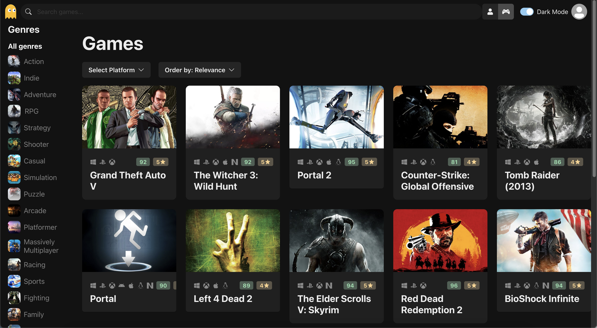
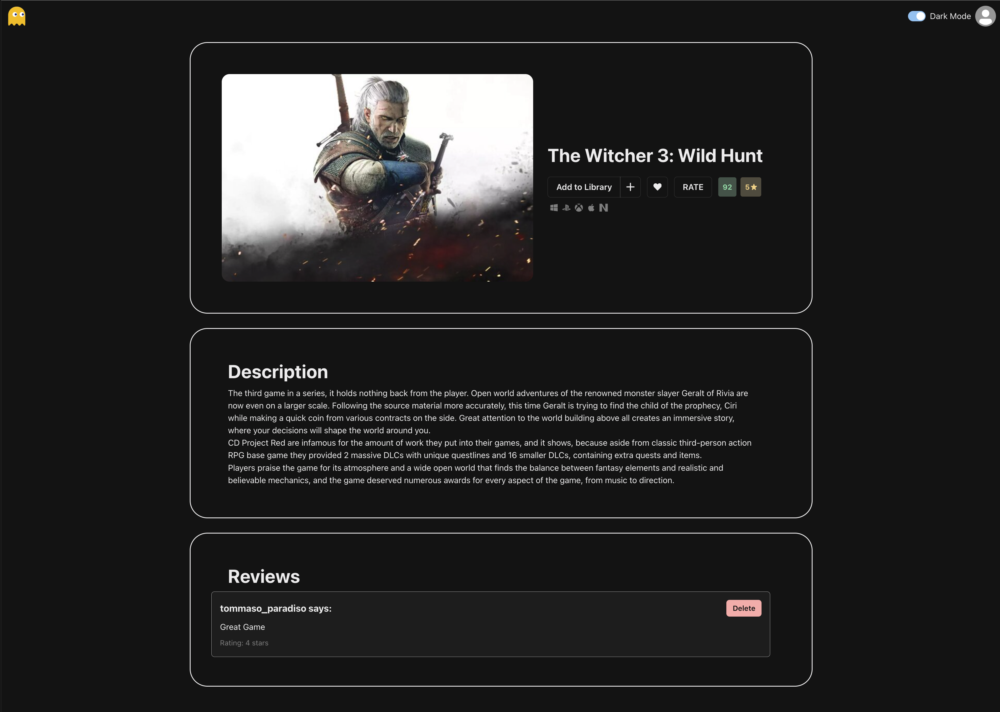
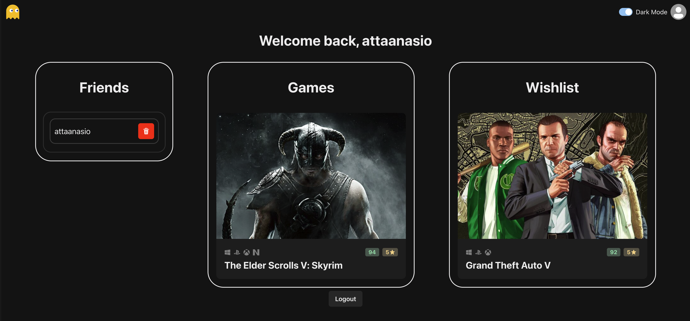

# **GameFinder 🎮**
A full-stack MERN app that lets users search games, manage collections/wishlists, write reviews, and authenticate via Google or email/password.  
Fast React frontend, clean Express backend, and MongoDB for persistence.

--- 
## Screenshots

### Home Page


### Game Page


### Profile Page


---

## **Features**
- 🔍 Game search with genre, platform, sorting, and text filters  
- 👤 User accounts (Google OAuth + email/password)  
- 🎮 Collections & wishlists (add/remove games)  
- 📝 Review system with rating, comment, author  
- 👥 Friends system (add/remove, list other users)  
- 🔐 JWT authentication  
- 🗄️ MongoDB models: Login, User, Review  

---

## **Tech Stack**

### **Frontend**
- React + TypeScript  
- Vite  
- Chakra UI  
- Axios  

### **Backend**
- Node.js + Express  
- MongoDB + Mongoose  
- Passport.js (Google OAuth)  
- bcrypt  
- JSON Web Tokens  
- CORS  

---

## Project Structure

```text
GameFinder/
│
├── client/              # Frontend (React + Vite)
│   ├── src/
│   └── ...
│
├── server/              # Backend (Express, MongoDB)
│   ├── models/
│   ├── auth/
│   ├── server.cjs
│   ├── secret.js
│   └── ...
│
└── README.md
```

---

## **API Overview**

### **Auth**
| Method | Endpoint | Description |
|--------|-----------|-------------|
| GET | `/auth/google` | Google OAuth login |
| POST | `/signup` | Create account |
| POST | `/login` | Email/password login |
| GET | `/userByToken/:token` | Fetch logged-in user |

### **Users**
| Method | Endpoint | Description |
|--------|-----------|-------------|
| GET | `/allUsers/:userId` | Get all users except self/friends |
| POST | `/changeFriendStatus` | Add/remove friends |

### **Games**
| Method | Endpoint | Description |
|--------|-----------|-------------|
| GET | `/gameStatus?userId&gameId` | Collection/wishlist status |
| POST | `/changeGameStatus` | Add/remove from collection/wishlist |

### **Reviews**
| Method | Endpoint | Description |
|--------|-----------|-------------|
| GET | `/reviews/:gameId` | Get reviews for a game |
| POST | `/addReview` | Add review |
| POST | `/deleteReview` | Delete review |

---

## **Environment Variables**
Create a `secret.js` inside `/server`:

```js
module.exports = {
    MONGO_DB_URL: "your-connection-string-here",
    jwt_secret: "your-secret-here"
};
```
## Then run both the sides separately

### Backend
```bash
cd server
npm install
node server.cjs
```
### Frontend
```bash
cd client
npm install
npm run dev
```
